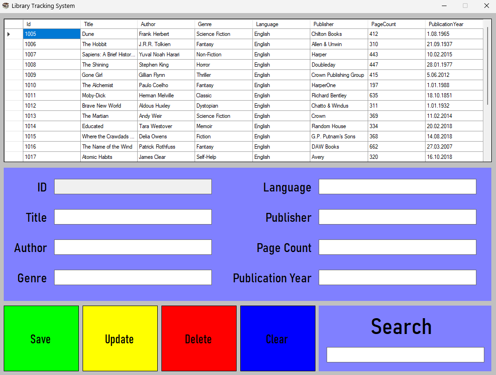
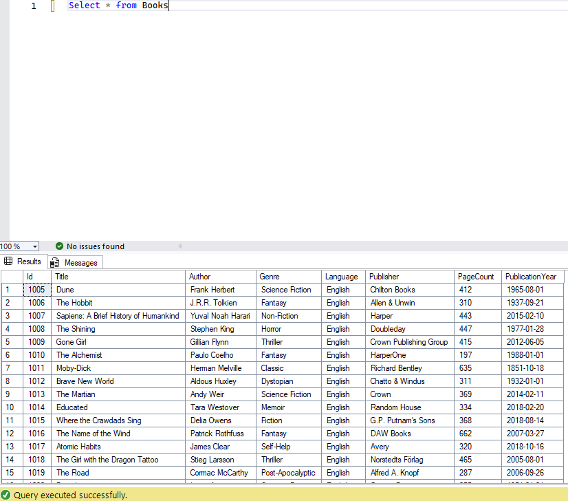
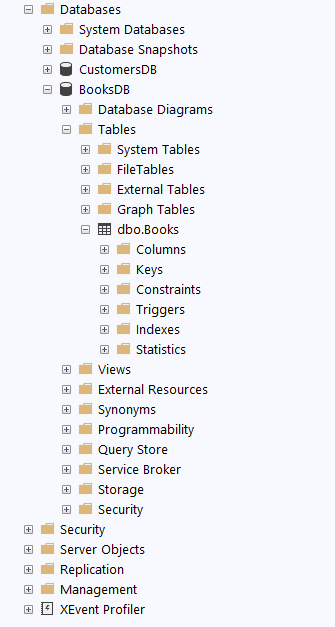

# 📚 Library Tracking System

<div align="center">




**A modern and user-friendly library management system**

[](https://dotnet.microsoft.com/)
[](https://docs.microsoft.com/en-us/dotnet/desktop/winforms/)
[](https://www.microsoft.com/sql-server)
[](https://docs.microsoft.com/en-us/dotnet/csharp/)

</div>

---

## 📋 Table of Contents

- [About the Project](#-about-the-project)
- [Features](#-features)
- [Technologies](#-technologies)
- [Requirements](#-requirements)
- [Installation](#-installation)
- [Database Structure](#-database-structure)
- [Usage Guide](#-usage-guide)
- [Project Structure](#-project-structure)
- [Screenshots](#-screenshots)
- [Development Notes](#-development-notes)
- [Contributing](#-contributing)
- [License](#-license)

---

## 🎯 About the Project

**Library Tracking System** is a professional library management system developed using Windows Forms technology. This application allows you to perform basic CRUD (Create, Read, Update, Delete) operations such as registering, updating, deleting, and searching books.

The application works integrated with SQL Server database to securely store and manage all book information. Thanks to its modern and user-friendly interface, it can be easily used.

### 🎨 Key Features

- ✨ **Modern Interface**: Colorful buttons and organized form structure
- 🔍 **Real-time Search**: Search-as-you-type feature
- 📊 **DataGridView Integration**: Display all books in table format
- 🔒 **Secure Data Management**: Secure data storage with SQL Server
- ⚡ **Fast and Efficient**: Optimized database queries

---

## ✨ Features

### 📖 Book Management

#### ✅ Add Book
- Add new books to the database
- Save all book information (title, author, genre, language, publisher, page count, publication year)
- Automatic ID generation
- Success message display

#### ✅ Update Book
- Edit existing book information
- Load selected book information from DataGridView to form fields
- Save updated information to database

#### ✅ Delete Book
- Delete books from database
- Secure deletion with ID validation
- Deletion confirmation message

#### ✅ List Books
- Display all books in DataGridView
- Automatic column expansion
- Read-only mode (prevents accidental editing)

#### ✅ View Details
- Load selected book details from table to form fields
- One-click access to book information

### 🔍 Search Features

- ✅ **Real-time Search**: Search as you type
- ✅ **Multi-field Search**: 
  - ID
  - Title
  - Author
  - Genre
- ✅ **Filtering**: Filter search results in real-time
- ✅ **Secure Search**: SQL injection protection

### 📊 Data Fields

The following information is stored for each book:

| Field | Description | Type |
|-------|-------------|------|
| **ID** | Automatically generated unique identifier | INT (Identity) |
| **Title** | Book title | NVARCHAR(200) |
| **Author** | Author name | NVARCHAR(100) |
| **Genre** | Book category/genre | NVARCHAR(50) |
| **Language** | Book language | NVARCHAR(50) |
| **Publisher** | Publisher | NVARCHAR(100) |
| **PageCount** | Number of pages | INT |
| **PublicationYear** | Publication year | INT |

---

## 🛠️ Technologies

### Technologies Used


- **.NET Framework 4.7.2**: Application framework
- **Windows Forms**: User interface technology
- **SQL Server Express**: Database management system
- **ADO.NET**: Database access technology
- **C#**: Programming language
- **DataGridView**: Data display control
- **SqlDataAdapter**: Data adapter

### Architecture

```
┌─────────────────┐
│  Windows Forms  │
│     (UI)        │
└────────┬────────┘
         │
         ▼
┌─────────────────┐
│   ADO.NET       │
│  (Data Access)  │
└────────┬────────┘
         │
         ▼
┌─────────────────┐
│  SQL Server     │
│   Database      │
└─────────────────┘
```

---

## 📦 Requirements

### System Requirements

- ✅ **Operating System**: Windows 7 or higher
- ✅ **.NET Framework**: 4.7.2 or higher
- ✅ **SQL Server**: Express Edition or higher
- ✅ **RAM**: Minimum 2 GB (4 GB recommended)
- ✅ **Disk Space**: Minimum 500 MB

### Development Environment

- ✅ **Visual Studio**: 2017 or higher
- ✅ **SQL Server Management Studio (SSMS)**: For database management
- ✅ **.NET Framework 4.7.2 SDK**

### Database Requirements

- ✅ SQL Server Express 2014 or higher
- ✅ Windows Authentication or SQL Server Authentication
- ✅ Database creation permissions

---

## 🚀 Installation

### 1️⃣ Download the Project

```bash
# Clone from GitHub
git clone https://github.com/Kaaner4mir/WindowsFormLabor.git

# Navigate to project directory
cd WindowsFormLabor/LibraryTrackingSystem
```

Or download as ZIP file and extract it.

### 2️⃣ Create the Database

Open SQL Server Management Studio and run the following SQL script:

```sql
-- Create database
CREATE DATABASE BooksDB;
GO

-- Use database
USE BooksDB;
GO

-- Create Books table
CREATE TABLE Books (
    Id INT PRIMARY KEY IDENTITY(1,1),
    Title NVARCHAR(200) NOT NULL,
    Author NVARCHAR(100) NOT NULL,
    Genre NVARCHAR(50),
    Language NVARCHAR(50),
    Publisher NVARCHAR(100),
    PageCount INT,
    PublicationYear INT
);
GO

-- Insert sample data (optional)
INSERT INTO Books (Title, Author, Genre, Language, Publisher, PageCount, PublicationYear)
VALUES 
    ('1984', 'George Orwell', 'Dystopian Fiction', 'English', 'Secker & Warburg', 328, 1949),
    ('To Kill a Mockingbird', 'Harper Lee', 'Fiction', 'English', 'J.B. Lippincott & Co.', 281, 1960),
    ('The Great Gatsby', 'F. Scott Fitzgerald', 'Fiction', 'English', 'Charles Scribner''s Sons', 180, 1925);
GO
```



### 3️⃣ Configure Connection String

Open `Form1.cs` file and update the connection string with your SQL Server information:

```csharp
// Edit the connection string on line 21
SqlConnection _connection = new SqlConnection(@"Data Source=YOUR_SERVER_NAME\SQLEXPRESS;Initial Catalog=BooksDB;Integrated Security=True;Encrypt=False");
```

**Important Notes:**

- Replace `YOUR_SERVER_NAME` with your computer name
- To find your SQL Server instance name:
  - Check the connection window in SQL Server Management Studio
  - Or run `hostname` command in Windows
- If using **Windows Authentication** (recommended):
  ```csharp
  @"Data Source=YOUR_SERVER_NAME\SQLEXPRESS;Initial Catalog=BooksDB;Integrated Security=True;Encrypt=False"
  ```
- If using **SQL Server Authentication**:
  ```csharp
  @"Data Source=YOUR_SERVER_NAME\SQLEXPRESS;Initial Catalog=BooksDB;User ID=your_username;Password=your_password;Encrypt=False"
  ```
- If using **LocalDB**:
  ```csharp
  @"Data Source=(localdb)\MSSQLLocalDB;Initial Catalog=BooksDB;Integrated Security=True;Encrypt=False"
  ```

### 4️⃣ Build and Run the Project

1. Open `LibraryTrackingSystem.sln` file in Visual Studio
2. Build the project from `Build > Build Solution` (Ctrl+Shift+B)
3. Run with `Debug > Start Debugging` (F5) or `Start Without Debugging` (Ctrl+F5)

### 5️⃣ First Use

- When the application opens, all books in the database are automatically listed
- To add a new book, fill in the form fields and click the **Save** button
- To edit an existing book, select it from the table and click the **Update** button

---

## 💾 Database Structure

### Books Table


| Column Name | Data Type | Nullable | Description |
|-------------|-----------|----------|-------------|
| **Id** | INT | ❌ | Primary Key, Identity (Auto-increment) |
| **Title** | NVARCHAR(200) | ❌ | Book title (Required) |
| **Author** | NVARCHAR(100) | ❌ | Author name (Required) |
| **Genre** | NVARCHAR(50) | ✅ | Book genre |
| **Language** | NVARCHAR(50) | ✅ | Book language |
| **Publisher** | NVARCHAR(100) | ✅ | Publisher |
| **PageCount** | INT | ✅ | Number of pages |
| **PublicationYear** | INT | ✅ | Publication year |

### Relationships

- **Primary Key**: `Id` (Identity, auto-increment)
- **Index**: Clustered index on `Id`

### Data Type Descriptions

- **INT**: For integer values
- **NVARCHAR**: For Unicode character strings (supports Turkish characters)
- **IDENTITY(1,1)**: Auto-increment number (starts at 1, increments by 1)

---

## 📖 Usage Guide

### 🆕 Adding a New Book

1. Fill in the form fields:
   - **Title**: Book title (required)
   - **Author**: Author name (required)
   - **Genre**: Book genre
   - **Language**: Book language
   - **Publisher**: Publisher
   - **PageCount**: Number of pages
   - **PublicationYear**: Publication year
2. Click the **Save** (Green) button
3. View the success message
4. See the newly added book in the book list

> **Note**: The ID field is automatically generated and cannot be edited.

### ✏️ Updating a Book

1. Click on the book you want to update from DataGridView
2. Form fields are automatically filled
3. Edit the desired fields
4. Click the **Update** (Yellow) button
5. View the success message
6. See the updated information in the list

> **Note**: Update cannot be performed if the ID field is empty.

### 🗑️ Deleting a Book

1. Click on the book you want to delete from DataGridView
2. Book information is loaded into form fields
3. Click the **Delete** (Red) button
4. View the confirmation message
5. Book is removed from the list

> **⚠️ Warning**: Deletion cannot be undone!

### 🔍 Searching

1. Type a search term in the **Search** box at the bottom right
2. Results are filtered in real-time
3. Search is performed in the following fields:
   - ID
   - Title
   - Author
   - Genre
4. Clear the search box to view all books again

**Search Examples:**
- "1984" → Books containing "1984" in ID or title
- "Orwell" → Books with "Orwell" in author name
- "Fiction" → Books with "Fiction" in genre

### 🧹 Clearing the Form

- Click the **Clear** (Blue) button to clear all form fields
- Clearing the form is useful when adding a new book

### 📊 Data Display

- All books are displayed in table format in DataGridView
- Columns are automatically expanded
- The table is in read-only mode (direct editing is not possible)
- Click on a row to view book details

---

## 📁 Project Structure

```
LibraryTrackingSystem/
│
├── 📄 Form1.cs                    # Main form logic and CRUD operations
├── 📄 Form1.Designer.cs          # Form design and UI components
├── 📄 Form1.resx                 # Form resource file
├── 📄 Program.cs                  # Application entry point
├── 📄 App.config                  # Application configuration file
├── 📄 LibraryTrackingSystem.csproj # Project file
│
├── 📁 Images/                     # Image files
│   ├── 🖼️ DB.png                 # Database image
│   ├── 🖼️ Linq.png               # LINQ image
│   ├── 🖼️ SqlFileStructure.png   # SQL structure image
│   └── 🖼️ WF.png                 # Windows Forms image
│
├── 📁 Properties/                 # Project properties
│   ├── 📄 AssemblyInfo.cs        # Assembly information
│   ├── 📄 Resources.Designer.cs  # Resource file designer
│   ├── 📄 Resources.resx         # Resource file
│   ├── 📄 Settings.Designer.cs   # Settings designer
│   └── 📄 Settings.settings      # Application settings
│
├── 📁 bin/                        # Compiled files
│   └── 📁 Debug/                  # Debug build outputs
│
└── 📁 obj/                        # Temporary build files
    └── 📁 Debug/                  # Debug obj files
```

### File Descriptions

| File | Description |
|------|-------------|
| `Form1.cs` | Main form class, all business logic is here |
| `Form1.Designer.cs` | Form design, UI controls |
| `Form1.resx` | Form resource file (icons, images) |
| `Program.cs` | Application entry point, Main method |
| `App.config` | Application configuration settings |
| `LibraryTrackingSystem.csproj` | Project file, references and settings |

---

## 🎨 Screenshots

### Main Form

When the application opens, all books are listed in DataGridView and form fields are ready to use.


### Features

- **Modern UI**: Colorful buttons and organized form structure
- **Responsive Design**: Automatic sizing
- **User-Friendly**: Easy-to-use interface
- **Color-Coded Buttons**: 
  - 🟢 Green: Save
  - 🟡 Yellow: Update
  - 🔴 Red: Delete
  - 🔵 Blue: Clear

### Database Structure


### SQL Structure


---

## 🔧 Development Notes

### Code Structure

#### Form1.cs
- **Connection Management**: Connection is opened and closed for each operation
- **CRUD Operations**: Create, Read, Update, Delete operations
- **Data Binding**: DataGridView is bound with DataTable
- **Event Handlers**: Event handlers for button clicks and cell selections

#### Important Methods

```csharp
// List books
void List()

// Clear form fields
void Clear()

// Add book
private void btnSave_Click(object sender, EventArgs e)

// Update book
private void btnUpdate_Click(object sender, EventArgs e)

// Delete book
private void btnDelete_Click(object sender, EventArgs e)

// Search
private void txtSearch_TextChanged(object sender, EventArgs e)
```

### Security

- ✅ **Parameterized Queries**: Parameterized queries are used for SQL injection protection
- ✅ **Input Sanitization**: Special characters are cleaned for search
- ✅ **Read-Only Grid**: DataGridView is in read-only mode

### Performance

- ✅ **Efficient Queries**: Optimized SQL queries
- ✅ **DataTable Caching**: Data is cached in DataTable
- ✅ **Connection Management**: Connection is opened and closed for each operation

### Improvement Suggestions

- 🔄 Connection string can be moved to `App.config` file
- 🔄 Error handling can be added with try-catch blocks
- 🔄 Data validation can be added
- 🔄 Repository pattern can be used
- 🔄 Unit tests can be written
- 🔄 Connection management can be improved with using statements
- 🔄 Async/await pattern can be used
- 🔄 ORMs like Entity Framework or Dapper can be used

---

## 🤝 Contributing

We welcome your contributions! To help improve this project:

### How Can You Contribute?

1. ⭐ **Star the Project**: If you liked the project, don't forget to star it!
2. 🐛 **Report Bugs**: If you found a bug, open an Issue
3. 💡 **Suggest Features**: Open an Issue for new features
4. 🔧 **Code Contribution**: Submit a Pull Request

### Steps to Submit a Pull Request

1. Fork this repository
2. Create a feature branch (`git checkout -b feature/AmazingFeature`)
3. Commit your changes (`git commit -m 'Add some AmazingFeature'`)
4. Push to the branch (`git push origin feature/AmazingFeature`)
5. Create a Pull Request

### Contribution Guidelines

- Follow code standards
- Add comments
- Test your code
- Update README if necessary

---

## 📞 Contact

For questions, suggestions, or bug reports:

- 📧 **GitHub Issues**: [Issues Page](https://github.com/Kaaner4mir/WindowsFormLabor/issues)
- 👤 **Developer**: Kaaner4mir
- 🔗 **Repository**: [WindowsFormLabor](https://github.com/Kaaner4mir/WindowsFormLabor)

---

## ⭐ Don't Forget to Star!

If you liked this project, don't forget to star it! ⭐

[](https://github.com/Kaaner4mir/WindowsFormLabor)

---

## 🙏 Thanks

Thank you for using this project!

- 📚 Developed to make library management easier
- 🎓 Can be used for educational purposes
- 💻 Open source for learning and development

---

## 📌 Important Notes

> **⚠️ Production Use**: This application is developed for educational purposes. It is recommended to make security and performance improvements before using it in a production environment.

> **💡 Tips**: 
> - Store connection string securely
> - Take regular database backups
> - Add error handling
> - Add logging mechanism

---

<div align="center">

**⭐ If you liked this project, don't forget to star it! ⭐**

Made with ❤️ by [Kaaner4mir](https://github.com/Kaaner4mir)

*Last Updated: 2025*

</div>
